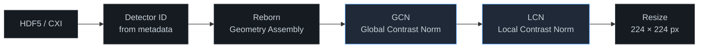
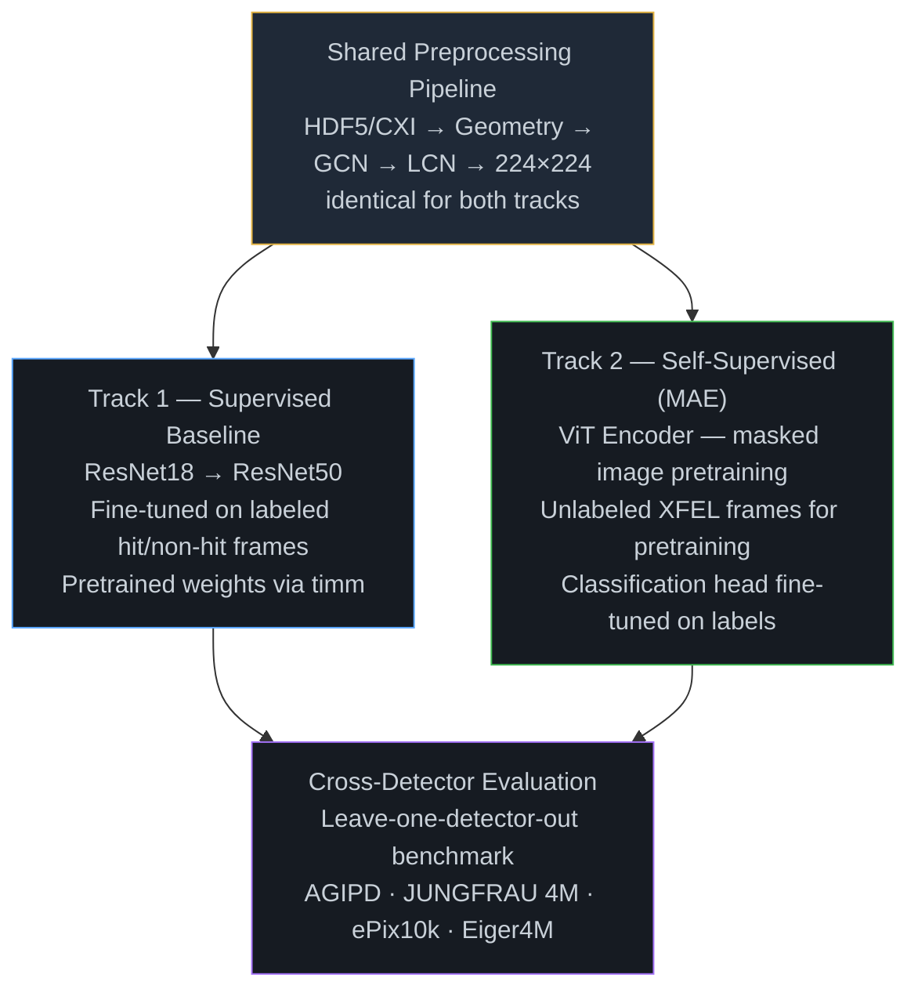

<div align="center">
  
</div>

<div align="center">

[](https://www.python.org/)
[](https://pytorch.org/)
[](https://github.com/gihankaushyal/Hit_finder/actions/workflows/ci.yml)
[](LICENSE)

[](https://biodesign.asu.edu/petra-fromme)

</div>

---

> Every pulse of an X-ray free-electron laser lasts just femtoseconds — yet in that instant, a protein crystal diffracts X-rays into a pattern that can reveal its atomic structure. The problem: fewer than 5% of those pulses actually hit a crystal. Identifying which frames are *hits* — fast, reliably, across instruments at different facilities worldwide — is the first bottleneck in every SFX experiment.

## The Challenge

Current hitfinders are calibrated per-detector. A model trained on AGIPD data at EuXFEL fails silently when deployed on JUNGFRAU data at LCLS. Every facility, every beamtime, requires manual recalibration. This project trains a single ML classifier that **generalizes across four detector types without per-detector retraining** — making hitfinding detector-agnostic.

## The Approach

### Shared Preprocessing Pipeline

All four detector types pass through an **identical, bit-for-bit pipeline** before reaching either model. Detector type is always read from file metadata — never inferred from image content.



> **Key constraint:** Normalization (GCN → LCN) always precedes resize. Resize is for model compatibility only — not detector correction.

### Two-Track Modeling

The shared pipeline feeds two independent model tracks. The supervised vs. self-supervised comparison is itself a scientific contribution of this work.



## Target Detectors

The model must generalize across all four detectors without per-detector retraining. Post-assembly, all images are normalized and resized to **224 × 224 × 1** (single channel).

| Detector | Facility | Raw Dimensions | Module Layout |
|----------|----------|----------------|---------------|
| `AGIPD` | EuXFEL | 16 × 512 × 128 px | 16 modules |
| `JUNGFRAU 4M` | LCLS CXI | 8 × 512 × 1024 px | 8 modules |
| `ePix10k` | LCLS | varies | multiple configurations |
| `Eiger4M` | Synchrotron / SSX | 2068 × 2162 px | monolithic |

## Project Status

| Phase | Description | Status |
|-------|-------------|--------|
| 1 | Proposal & methodology finalization | ✅ Complete |
| 2 | Data infrastructure (real + synthetic) | ✅ Complete |
| 3 | Preprocessing implementation | ✅ Complete |
| 4 | Supervised baseline (ResNet18 → ResNet50) | ✅ Complete |
| **5** | **SSL model (MAE pretraining → fine-tune)** | 🔄 **IN PROGRESS** |
| 6 | Ablations & cross-detector benchmarking | ⏳ Pending |
| 7 | Deployment preparation | 🔮 Future |
| 8 | Thesis writing | 🔮 Future |

## Preliminary Results — Phase 4 Supervised Baseline

ResNet18 trained on 10,000 synthetic SFX frames (`hitfinder_10k`), evaluated on 2,000 held-out frames (`hitfinder_val`). Both sets are pre-assembled 512×512 synthetic Eiger-like images; preprocessing: GCN → LCN (window=9) → resize 224×224.

| Metric | Score |
|--------|-------|
| Average Precision | **0.9998** |
| AUC-ROC | **0.9998** |
| F1 (optimal threshold) | **0.9995** |
| Precision | **1.0000** |
| Recall | **0.9990** |

Confusion matrix (2000 frames, 50/50 hit rate): TP=989 · FP=0 · FN=1 · TN=1010. Model early-stopped at epoch 22/200 (patience=20). Checkpoint: `checkpoints/resnet18-10k-full-seed42/best.pt`.

> These results are in-domain (train and test from the same synthetic distribution). Cross-detector generalization on real detector data is the Phase 6 scientific benchmark.

## Setup

**Compute:** ASU Sol HPC — 8× NVIDIA A100 (80 GB) · SLURM scheduler

```bash
# Create environment (first time)
mamba env create -f environment.yml -n sfx-hitfinder

# Activate (always in this order on Sol)
module load mamba/latest
conda activate sfx-hitfinder

# Verify imports
python -c "import torch, h5py, reborn, timm, fabio; print('imports OK')"

# Verify CUDA on a compute node
srun --partition=<your-partition> --gpus=1 --pty bash
python -c "import torch; print(torch.cuda.is_available(), torch.version.cuda)"
```

**Supported image formats:** `.h5` / `.cxi` (HDF5, multi-panel detectors via Reborn) and `.img` (ADSC/MAR, pre-assembled, read via fabio).

```bash
# Run tests
pytest tests/ -v

# Check formatting before committing
black src/ tests/
```

## Citation

If you use this work, please cite:

```bibtex
@misc{ketawala2026sfxhitfinder,
  author      = {Ketawala, Gihan},
  title       = {Detector-Agnostic Hitfinder for Serial Femtosecond X-ray Crystallography},
  year        = {2026},
  note        = {Arizona State University, Fromme Lab},
  url         = {https://github.com/gihankaushyal/Hit_finder}
}
```

## Acknowledgments

Developed at the [Fromme Lab](https://biodesign.asu.edu/petra-fromme), Biodesign Institute, Arizona State University, under the supervision of Prof. Petra Fromme. Compute resources provided by the ASU Sol HPC cluster.
