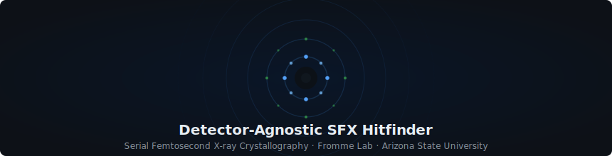

  

---

> Every pulse of an X-ray free-electron laser lasts just femtoseconds — yet in that instant, a protein crystal diffracts X-rays into a pattern that can reveal its atomic structure. The problem: fewer than 5% of those pulses actually hit a crystal. Identifying which frames are *hits* — fast, reliably, across instruments at different facilities worldwide — is the first bottleneck in every SFX experiment.

## The Challenge

Current hitfinders are calibrated per-detector. A model trained on AGIPD data at EuXFEL fails silently when deployed on JUNGFRAU data at LCLS. Every facility, every beamtime, requires manual recalibration. This project trains a single ML classifier that **generalizes across four detector types without per-detector retraining** — making hitfinding detector-agnostic.
