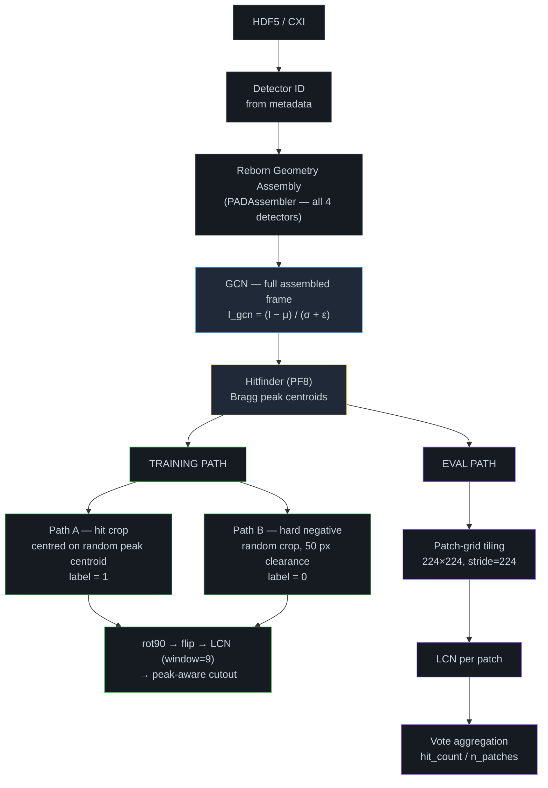
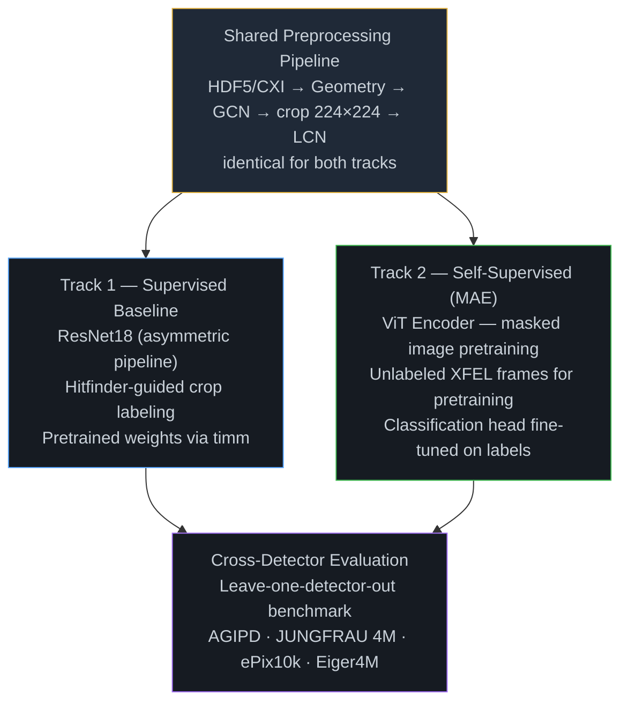

<div align="center">
  
</div>

<div align="center">

[](https://www.python.org/)
[](https://pytorch.org/)
[](https://github.com/gihankaushyal/Hit_finder/actions/workflows/ci.yml)
[](LICENSE)

[](https://biodesign.asu.edu/petra-fromme)

</div>

---

> Every pulse of an X-ray free-electron laser lasts just femtoseconds — yet in that instant, a protein crystal diffracts X-rays into a pattern that can reveal its atomic structure. The problem: fewer than 5% of those pulses actually hit a crystal. Identifying which frames are *hits* — fast, reliably, across instruments at different facilities worldwide — is the first bottleneck in every SFX experiment.

## The Challenge

Current hitfinders are calibrated per-detector. A model trained on AGIPD data at EuXFEL fails silently when deployed on JUNGFRAU data at LCLS. Every facility, every beamtime, requires manual recalibration. This project trains a single ML classifier that **generalizes across four detector types without per-detector retraining** — making hitfinding detector-agnostic. The key: a hitfinder-guided asymmetric crop strategy that assigns labels at the patch level from Bragg spot centroids, not at the frame level.

## The Approach

### Shared Preprocessing Pipeline

All four detector types pass through an **identical, bit-for-bit pipeline** before reaching either model. Detector type is always read from file metadata — never inferred from image content.


```mermaid
flowchart TD
    A["HDF5 / CXI"] --> B["Detector ID\nfrom metadata"]
    B --> C["Reborn Geometry Assembly\n(PADAssembler — all 4 detectors)"]
    C --> D["GCN — full assembled frame\nI_gcn = (I − μ) / (σ + ε)"]
    D --> HF["Hitfinder (PF8)\nBragg peak centroids"]

    HF --> TRAIN["TRAINING PATH"]
    HF --> EVAL["EVAL PATH"]

    TRAIN --> PA["Path A — hit crop\ncentred on random peak centroid\nlabel = 1"]
    TRAIN --> PB["Path B — hard negative\nrandom crop, 50 px clearance\nlabel = 0"]

    PA --> AUG["rot90 → flip → LCN (window=9)\n→ peak-aware cutout"]
    PB --> AUG

    EVAL --> GRID["Patch-grid tiling\n224×224, stride=224"]
    GRID --> ELCN["LCN per patch"]
    ELCN --> AGG["Vote aggregation\nhit_count / n_patches"]

    style A fill:#161b22,stroke:#30363d,color:#c9d1d9
    style B fill:#161b22,stroke:#30363d,color:#c9d1d9
    style C fill:#161b22,stroke:#30363d,color:#c9d1d9
    style D fill:#1f2937,stroke:#58a6ff,color:#c9d1d9
    style HF fill:#1f2937,stroke:#e3b341,color:#c9d1d9
    style TRAIN fill:#161b22,stroke:#3fb950,color:#c9d1d9
    style EVAL fill:#161b22,stroke:#a371f7,color:#c9d1d9
    style PA fill:#161b22,stroke:#3fb950,color:#c9d1d9
    style PB fill:#161b22,stroke:#3fb950,color:#c9d1d9
    style AUG fill:#161b22,stroke:#3fb950,color:#c9d1d9
    style GRID fill:#161b22,stroke:#a371f7,color:#c9d1d9
    style ELCN fill:#161b22,stroke:#a371f7,color:#c9d1d9
    style AGG fill:#161b22,stroke:#a371f7,color:#c9d1d9
```

> **Key constraint:** GCN is always computed on the full assembled frame before cropping or tiling — never per-patch.

### Two-Track Modeling

The shared pipeline feeds two independent model tracks. The supervised vs. self-supervised comparison is itself a scientific contribution of this work.


```mermaid
flowchart TD
    PP["Shared Preprocessing Pipeline\nHDF5/CXI → Geometry → GCN → crop 224×224 → LCN\nidentical for both tracks"]

    PP --> T1["Track 1 — Supervised Baseline\nResNet18 (asymmetric pipeline)\nHitfinder-guided crop labeling\nPretrained weights via timm"]
    PP --> T2["Track 2 — Self-Supervised (MAE)\nViT Encoder — masked image pretraining\nUnlabeled XFEL frames for pretraining\nClassification head fine-tuned on labels"]

    T1 --> E["Cross-Detector Evaluation\nLeave-one-detector-out benchmark\nAGIPD · JUNGFRAU 4M · ePix10k · Eiger4M"]
    T2 --> E

    style PP fill:#1f2937,stroke:#e3b341,color:#c9d1d9
    style T1 fill:#161b22,stroke:#58a6ff,color:#c9d1d9
    style T2 fill:#161b22,stroke:#3fb950,color:#c9d1d9
    style E fill:#161b22,stroke:#a371f7,color:#c9d1d9
```

> **Key constraint:** 224×224 is achieved via crop only — frames are never downsampled. Normalization order: GCN (full frame) → crop → LCN.

## Target Detectors

The model must generalize across all four detectors without per-detector retraining. Post-assembly, all images are normalized and cropped to **224 × 224 × 1** (single channel).

| Detector | Facility | Raw Dimensions | Module Layout |
|----------|----------|----------------|---------------|
| `AGIPD` | EuXFEL | 16 × 512 × 128 px | 16 modules |
| `JUNGFRAU 4M` | LCLS CXI | 8 × 514 × 1030 px | 8 modules |
| `ePix10k` | LCLS | varies | multiple configurations |
| `Eiger4M` | Synchrotron / SSX | 2068 × 2162 px | monolithic |

## Project Status

| Phase | Description | Status |
|-------|-------------|--------|
| 1 | Proposal & methodology finalization | ✅ Complete |
| 2 | Data infrastructure (real + synthetic) | ✅ Complete |
| 3 | Preprocessing implementation | ✅ Complete |
| 4 | Supervised baseline (ResNet18 → ResNet50) | ✅ Complete |
| **5** | **SSL model (MAE pretraining → fine-tune)** | 🔄 **IN PROGRESS** |
| 6 | Ablations & cross-detector benchmarking | ⏳ Pending |
| 7 | Deployment preparation | 🔮 Future |
| 8 | Thesis writing | 🔮 Future |

## Results — Supervised Learning Baseline (LODO, 4-fold)

Leave-one-detector-out (LODO) cross-detector generalization benchmark. Each fold holds out one detector type entirely from training and evaluates on it at test time. Metrics are computed at the frame level via patch-grid vote aggregation.

### Phase 4 Naive Baseline — frame-level labels, random crops

| Fold | Held-out | Cross AP | Cross AUC | Cross F1 |
|------|----------|----------|-----------|----------|
| 1 | AGIPD | 0.5649 | 0.5904 | 0.6661 |
| 2 | JUNGFRAU 4M | 0.8683 | 0.8156 | 0.7816 |
| 3 | ePix10k | 0.8825 | 0.8886 | 0.8092 |
| 4 | Eiger4M | 0.9310 | 0.9138 | 0.8189 |
| **Mean** | | **0.812 ± 0.167** | | |

The naive pipeline assigned frame-level hit/non-hit labels to all random 224×224 crops — including background crops from hit frames — producing ambiguous training signal. AGIPD cross AP of 0.565 reflects near-random generalization.

### Asymmetric Pipeline Baseline — hitfinder-guided crops + masked LCN

Hitfinder-guided cropping (Path A: centroid-centred, label=1 / Path B: hard-negative, label=0), variance-form masked LCN, and peak-aware cutout replace the naive strategy.

| Fold | Held-out | Cross AP | Cross AUC | Cross F1 | Δ AP |
|------|----------|----------|-----------|----------|------|
| 1 | AGIPD | 0.8074 | 0.8652 | 0.8108 | **+0.242** |
| 2 | JUNGFRAU 4M | 0.8584 | 0.9639 | 0.7570 | −0.010 |
| 3 | ePix10k | 0.8585 | 0.9106 | 0.8943 | −0.024 |
| 4 | Eiger4M | 0.8330 | 0.8596 | 0.8138 | −0.098 |
| **Mean** | | **0.839 ± 0.021** | | | **+0.027** |

- **AGIPD generalization gap largely closed:** 0.565 → 0.807 (+0.242). Hitfinder-guided crops eliminated the spurious panel-edge signal the model previously relied on.
- **Variance collapsed 8×:** ±0.167 → ±0.021 — the pipeline is now consistently effective across all four detector types.
- Full per-fold in-domain breakdown → [docs/detailed_notes.md](docs/detailed_notes.md)

## Setup

**Compute:** ASU Sol HPC — dedicated H100 (scg020) + A100 pool · SLURM scheduler

```bash
# Create environment (first time)
mamba env create -f environment.yml -n sfx-hitfinder

# Activate (always in this order on Sol)
module load mamba/latest
source activate sfx-hitfinder

# Verify imports
python -c "import torch, h5py, reborn, timm, fabio; print('imports OK')"

# Verify CUDA on a compute node
srun --partition=<your-partition> --gpus=1 --pty bash
python -c "import torch; print(torch.cuda.is_available(), torch.version.cuda)"
```

**Supported image formats:** `.h5` / `.cxi` (HDF5, multi-panel detectors via Reborn) and `.img` (ADSC/MAR, pre-assembled, read via fabio).

```bash
# Run tests
pytest tests/ -v

# Check formatting before committing
black src/ tests/
```

## Documentation

| Document | Contents |
|----------|----------|
| [Detailed Notes](docs/detailed_notes.md) | Full per-fold LODO results with in-domain breakdown, pipeline decisions |
| [Architecture](docs/architecture.md) | Codebase structure and component design |
| [Codebase Reference](docs/codebase/index.md) | Module map, data flow, extension guide, testing |
| [Evaluation Protocol](docs/eval_protocol.md) | LODO benchmark design and metrics |
| [Data Spec](docs/data_spec.md) | HDF5 key reference per detector type |

## Citation

If you use this work, please cite:

```bibtex
@misc{ketawala2026sfxhitfinder,
  author      = {Ketawala, Gihan},
  title       = {Detector-Agnostic Hitfinder for Serial Femtosecond X-ray Crystallography},
  year        = {2026},
  note        = {Arizona State University, Fromme Lab},
  url         = {https://github.com/gihankaushyal/Hit_finder}
}
```

## Acknowledgments

Developed at the [Fromme Lab](https://biodesign.asu.edu/petra-fromme), Biodesign Institute, Arizona State University, under the supervision of Prof. Petra Fromme. Compute resources provided by the ASU Sol HPC cluster.
