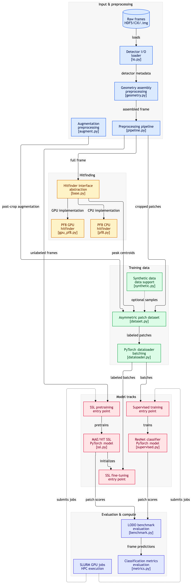

# Codebase Reference

> Read this page before modifying any module. Use the sub-pages to navigate to what you need.

This reference covers the Hit_finder SFX hit-classification system — a deep learning pipeline that reads raw detector frames from CXI files and outputs per-frame hit/no-hit predictions.

---

## Pipeline Overview

The hand-annotated diagram below shows every component from raw frames to SLURM job submission:

---

## Module Dependency Graph

Auto-generated from the live codebase (849 nodes, 1515 edges). Thicker clusters are tighter communities; god nodes are the most-connected functions:

---

## Navigation

| Page | Use this when… |
|------|---------------|
| [Module Reference](modules.md) | "I need to modify X — what imports it and what does it import?" |
| [Data Flow Walkthrough](data-flow.md) | "Walk me through what happens to a frame from disk to prediction" |
| [Extension Guide](extension-guide.md) | "Where do I add a new detector / hitfinder backend / model / metric?" |
| [Testing Guide](testing.md) | "How do I run the tests? Where do I add a new test?" |

---

## God Nodes (most-connected — highest blast radius)

If you touch these, run the full test suite.

| Function | File | Edges |
|----------|------|-------|
| `run_patch_agg()` | `src/evaluation/benchmark.py` | 28 |
| `get_geometry()` | `src/preprocessing/geometry.py` | 22 |
| `read_frame()` | `src/preprocessing/io.py` | 22 |
| `lcn()` | `src/preprocessing/normalize.py` | 21 |
| `gcn()` | `src/preprocessing/normalize.py` | 18 |
| `GPUHitfinder` | `src/hitfinders/gpu_pf8.py` | 18 |
| `read_embedded_labels()` | `src/preprocessing/io.py` | 18 |
| `MultiFrameCXIDataset` | `src/data/dataset.py` | 19 |
