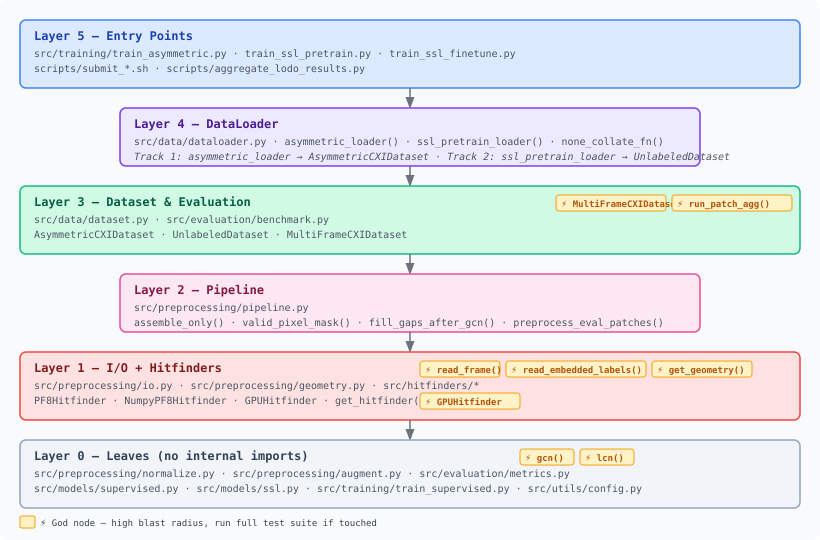

# Codebase Reference

> Read this page before modifying any module. Use the sub-pages to navigate to what you need.

This reference covers the Hit_finder SFX hit-classification system — a deep learning pipeline that reads raw detector frames from CXI files and outputs per-frame hit/no-hit predictions.

---

## Two-Track Architecture

The project runs two parallel modeling strategies that share the same preprocessing pipeline:

**Track 1 — Supervised** trains a ResNet18/50 directly on labeled CXI frames. A hitfinder (PF8 or GPU) locates Bragg peaks on each frame; crops centered on those peaks become positive training examples, while crops placed ≥50 px from all peaks become negatives. Labels are derived on-the-fly — no pre-labeled dataset required beyond the CXI files themselves.

**Track 2 — Self-Supervised (MAE)** pretrain a ViT-S/16 encoder on a large pool of *unlabeled* diffraction frames using masked autoencoders (MAE): 75% of 224×224 patches are masked out and the model learns to reconstruct them from context. A classification head is then fine-tuned on the same labeled CXI data as Track 1.

Both tracks run the **identical preprocessing pipeline** — GCN on the full assembled frame → gap fill → 224×224 crop/tile → LCN → augmentation — so any preprocessing change affects both. The comparison between Track 1 and Track 2 is itself a scientific contribution of this project.

---

## Module Dependency Graph

Auto-generated from the live codebase. Thicker clusters are tighter communities; ⚡ badges mark the most-connected functions (highest blast radius):

> **For function-level exploration with pan/zoom/search** — open [`graphify-out/graph.html`](../../graphify-out/graph.html) in a browser (849 nodes, 1515 edges).

---

## Navigation

| Page | Use this when… |
|------|---------------|
| [Module Reference](modules.md) | "I need to modify X — what imports it and what does it import?" |
| [Data Flow Walkthrough](data-flow.md) | "Walk me through what happens to a frame from disk to prediction" |
| [Extension Guide](extension-guide.md) | "Where do I add a new detector / hitfinder backend / model / metric?" |
| [Testing Guide](testing.md) | "How do I run the tests? Where do I add a new test?" |

---

## God Nodes (most-connected — highest blast radius)

If you touch these, run the full test suite.

| Function | File | Edges |
|----------|------|-------|
| `run_patch_agg()` | `src/evaluation/benchmark.py` | 28 |
| `get_geometry()` | `src/preprocessing/geometry.py` | 22 |
| `read_frame()` | `src/preprocessing/io.py` | 22 |
| `lcn()` | `src/preprocessing/normalize.py` | 21 |
| `gcn()` | `src/preprocessing/normalize.py` | 18 |
| `GPUHitfinder` | `src/hitfinders/gpu_pf8.py` | 18 |
| `read_embedded_labels()` | `src/preprocessing/io.py` | 18 |
| `MultiFrameCXIDataset` | `src/data/dataset.py` | 19 |
