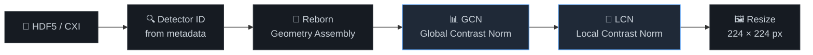
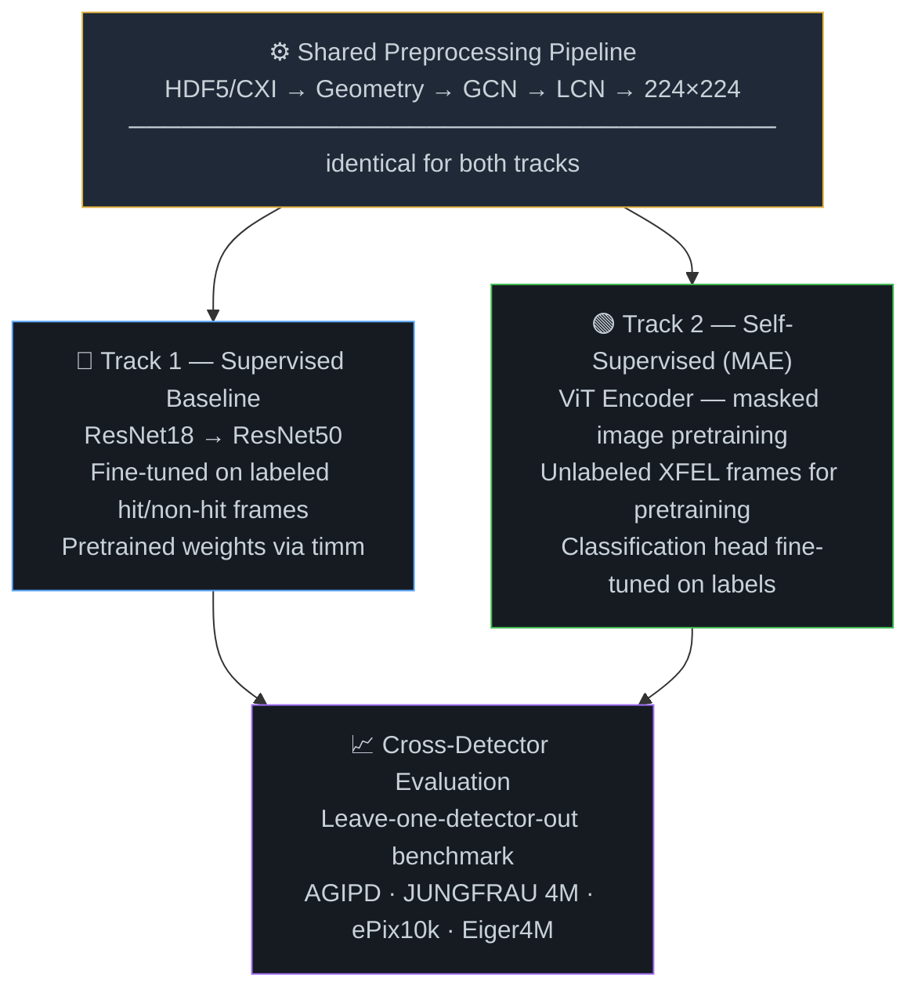

# README Implementation Plan

> **For agentic workers:** REQUIRED SUB-SKILL: Use superpowers:subagent-driven-development (recommended) or superpowers:executing-plans to implement this plan task-by-task. Steps use checkbox (`- [ ]`) syntax for tracking.

**Goal:** Create a production-quality GitHub README for the SFX Hitfinder project with an SVG hero banner, Mermaid diagrams, badge strip, and narrative structure.

**Architecture:** All graphics except the hero banner are Mermaid diagrams embedded inline in markdown (GitHub-native rendering). The hero banner is a standalone SVG file committed to `docs/assets/` and referenced with an `` tag. No external image hosting required.

**Tech Stack:** Markdown, SVG, Mermaid (GitHub-native), shields.io badges

---

## File Structure

| File | Action | Purpose |
|------|--------|---------|
| `README.md` | Create | Main readme — all sections |
| `docs/assets/hero-banner.svg` | Create | Diffraction ring hero image |
| `.gitignore` | Modify | Add `.superpowers/` entry |

---

### Task 1: Create the hero banner SVG

**Files:**
- Create: `docs/assets/hero-banner.svg`

- [ ] **Step 1: Create `docs/assets/` directory**

```bash
mkdir -p docs/assets
```

- [ ] **Step 2: Write `docs/assets/hero-banner.svg`**

```svg
<svg xmlns="http://www.w3.org/2000/svg" viewBox="0 0 860 220" width="860" height="220">
  <defs>
    <radialGradient id="bg" cx="50%" cy="50%" r="60%">
      <stop offset="0%" stop-color="#0a1628"/>
      <stop offset="100%" stop-color="#0d1117"/>
    </radialGradient>
  </defs>

  <!-- Background -->
  <rect width="860" height="220" fill="url(#bg)" rx="8"/>

  <!-- Diffraction rings -->
  <circle cx="430" cy="110" r="30"  fill="none" stroke="#1a3a5c" stroke-width="1.5" opacity="0.7"/>
  <circle cx="430" cy="110" r="55"  fill="none" stroke="#1a3a5c" stroke-width="1.2" opacity="0.6"/>
  <circle cx="430" cy="110" r="82"  fill="none" stroke="#163356" stroke-width="1.0" opacity="0.5"/>
  <circle cx="430" cy="110" r="112" fill="none" stroke="#163356" stroke-width="0.8" opacity="0.4"/>
  <circle cx="430" cy="110" r="145" fill="none" stroke="#0f2440" stroke-width="0.7" opacity="0.35"/>
  <circle cx="430" cy="110" r="180" fill="none" stroke="#0a1a30" stroke-width="0.6" opacity="0.25"/>

  <!-- Bragg spots — ring 1 (blue) -->
  <circle cx="430" cy="80"  r="2.8" fill="#58a6ff" opacity="0.95"/>
  <circle cx="430" cy="140" r="2.8" fill="#58a6ff" opacity="0.95"/>
  <circle cx="400" cy="110" r="2.8" fill="#58a6ff" opacity="0.95"/>
  <circle cx="460" cy="110" r="2.8" fill="#58a6ff" opacity="0.95"/>
  <circle cx="409" cy="89"  r="2.2" fill="#79c0ff" opacity="0.75"/>
  <circle cx="451" cy="89"  r="2.2" fill="#79c0ff" opacity="0.75"/>
  <circle cx="409" cy="131" r="2.2" fill="#79c0ff" opacity="0.75"/>
  <circle cx="451" cy="131" r="2.2" fill="#79c0ff" opacity="0.75"/>

  <!-- Bragg spots — ring 2 (green) -->
  <circle cx="430" cy="55"  r="2.0" fill="#3fb950" opacity="0.65"/>
  <circle cx="430" cy="165" r="2.0" fill="#3fb950" opacity="0.65"/>
  <circle cx="375" cy="110" r="2.0" fill="#3fb950" opacity="0.65"/>
  <circle cx="485" cy="110" r="2.0" fill="#3fb950" opacity="0.65"/>
  <circle cx="391" cy="71"  r="1.6" fill="#3fb950" opacity="0.5"/>
  <circle cx="469" cy="71"  r="1.6" fill="#3fb950" opacity="0.5"/>
  <circle cx="391" cy="149" r="1.6" fill="#3fb950" opacity="0.5"/>
  <circle cx="469" cy="149" r="1.6" fill="#3fb950" opacity="0.5"/>

  <!-- Beamstop -->
  <circle cx="430" cy="110" r="16" fill="#0d1117" opacity="0.97"/>
  <circle cx="430" cy="110" r="7"  fill="#111820" opacity="0.85"/>

  <!-- Title text -->
  <text x="430" y="190" text-anchor="middle"
        font-family="-apple-system, BlinkMacSystemFont, 'Segoe UI', sans-serif"
        font-size="20" font-weight="700" fill="#e6edf3" letter-spacing="-0.3">
    Detector-Agnostic SFX Hitfinder
  </text>
  <text x="430" y="210" text-anchor="middle"
        font-family="-apple-system, BlinkMacSystemFont, 'Segoe UI', sans-serif"
        font-size="12" fill="#8b949e" letter-spacing="0.2">
    Serial Femtosecond X-ray Crystallography · Fromme Lab · Arizona State University
  </text>
</svg>
```

- [ ] **Step 3: Verify the SVG renders in a browser**

```bash
open docs/assets/hero-banner.svg
```

Expected: dark background with concentric rings, blue/green Bragg spots, title text at bottom.

- [ ] **Step 4: Commit**

```bash
git add docs/assets/hero-banner.svg
git commit -m "feat: add hero banner SVG with diffraction ring pattern"
```

---

### Task 2: Create README skeleton — header, badges, hook, challenge

**Files:**
- Create: `README.md`

- [ ] **Step 1: Write `README.md` up to and including "The Challenge"**

```markdown
<div align="center">
  
</div>

<div align="center">

[](https://www.python.org/)
[](https://pytorch.org/)
[](LICENSE)
[]()
[](https://biodesign.asu.edu/petra-fromme)

</div>

---

> Every pulse of an X-ray free-electron laser lasts just femtoseconds — yet in that instant, a protein crystal diffracts X-rays into a pattern that can reveal its atomic structure. The problem: fewer than 5% of those pulses actually hit a crystal. Identifying which frames are *hits* — fast, reliably, across instruments at different facilities worldwide — is the first bottleneck in every SFX experiment.

## The Challenge

Current hitfinders are calibrated per-detector. A model trained on AGIPD data at EuXFEL fails silently when deployed on JUNGFRAU data at LCLS. Every facility, every beamtime, requires manual recalibration. This project trains a single ML classifier that **generalizes across four detector types without per-detector retraining** — making hitfinding detector-agnostic.
```

- [ ] **Step 2: Verify markdown renders locally**

```bash
# If you have grip installed:
grip README.md
# Otherwise open on GitHub after pushing, or use VS Code markdown preview
```

- [ ] **Step 3: Commit**

```bash
git add README.md
git commit -m "feat: add README skeleton with hero banner, badges, hook, challenge"
```

---

### Task 3: Add preprocessing pipeline diagram

**Files:**
- Modify: `README.md`

- [ ] **Step 1: Append "The Approach" section with pipeline Mermaid diagram to `README.md`**

```markdown
## The Approach

### Shared Preprocessing Pipeline

All four detector types pass through an **identical, bit-for-bit pipeline** before reaching either model. Detector type is always read from file metadata — never inferred from image content.



> **Key constraint:** Normalization (GCN → LCN) always precedes resize. Resize is for model compatibility only — not detector correction.
```

- [ ] **Step 2: Commit**

```bash
git add README.md
git commit -m "feat: add preprocessing pipeline Mermaid diagram"
```

---

### Task 4: Add two-track architecture diagram

**Files:**
- Modify: `README.md`

- [ ] **Step 1: Append two-track section after pipeline in `README.md`**

```markdown
### Two-Track Modeling

The shared pipeline feeds two independent model tracks. The supervised vs. self-supervised comparison is itself a scientific contribution of this work.


```

- [ ] **Step 2: Commit**

```bash
git add README.md
git commit -m "feat: add two-track architecture Mermaid diagram"
```

---

### Task 5: Add detector table and project status

**Files:**
- Modify: `README.md`

- [ ] **Step 1: Append detector section and phase status to `README.md`**

```markdown
## Target Detectors

The model must generalize across all four detectors without per-detector retraining. Post-assembly, all images are normalized and resized to **224 × 224 × 1** (single channel).

| Detector | Facility | Raw Dimensions | Module Layout |
|----------|----------|----------------|---------------|
| `AGIPD` | EuXFEL | 16 × 512 × 128 px | 16 modules |
| `JUNGFRAU 4M` | LCLS CXI | 8 × 512 × 1024 px | 8 modules |
| `ePix10k` | LCLS | varies | multiple configurations |
| `Eiger4M` | Synchrotron / SSX | 2068 × 2162 px | monolithic |

## Project Status

| Phase | Description | Status |
|-------|-------------|--------|
| **1** | Proposal & methodology finalization | ✅ **CURRENT** |
| 2 | Data infrastructure (real + synthetic) | ⏳ Pending |
| 3 | Preprocessing implementation | ⏳ Pending |
| 4 | Supervised baseline (ResNet18 → ResNet50) | ⏳ Pending |
| 5 | SSL model (MAE pretraining → fine-tune) | ⏳ Pending |
| 6 | Ablations & cross-detector benchmarking | ⏳ Pending |
| 7 | Deployment preparation | 🔮 Future |
| 8 | Thesis writing | 🔮 Future |
```

- [ ] **Step 2: Commit**

```bash
git add README.md
git commit -m "feat: add detector table and project status section"
```

---

### Task 6: Add setup placeholder, citation, and acknowledgments

**Files:**
- Modify: `README.md`

- [ ] **Step 1: Append final sections to `README.md`**

```markdown
## Setup

> ⚠️ **Environment setup and training instructions are coming in Phase 2.**
> The conda environment definition (`environment.yml`) and SLURM job scripts will be finalized once the Sol HPC data pipeline is established.
>
> **Compute:** ASU Sol HPC — 8× NVIDIA A100 (80 GB) · SLURM scheduler · Partition: `htc`

## Citation

If you use this work, please cite:

```bibtex
@misc{ketawala2026sfxhitfinder,
  author      = {Ketawala, Gihan},
  title       = {Detector-Agnostic Hitfinder for Serial Femtosecond X-ray Crystallography},
  year        = {2026},
  institution = {Arizona State University, Fromme Lab},
  url         = {https://github.com/gihankaushyal/Hit_finder}
}
```

## Acknowledgments

Developed at the [Fromme Lab](https://biodesign.asu.edu/petra-fromme), Biodesign Institute, Arizona State University, under the supervision of Prof. Petra Fromme. Compute resources provided by the ASU Sol HPC cluster.
```

- [ ] **Step 2: Commit**

```bash
git add README.md
git commit -m "feat: add setup placeholder, citation, and acknowledgments"
```

---

### Task 7: Update .gitignore and final polish

**Files:**
- Modify: `.gitignore`

- [ ] **Step 1: Create `.gitignore` with standard Python + project entries**

```
# Python
__pycache__/
*.py[cod]
*.egg-info/
.venv/
dist/
build/

# Jupyter
.ipynb_checkpoints/

# Conda
*.conda

# Weights & Biases
wandb/

# Logs
logs/

# Data (actual data lives on Sol — only symlinks committed)
data/raw/*
data/processed/*
data/synthetic/*
!data/raw/.gitkeep
!data/processed/.gitkeep
!data/synthetic/.gitkeep

# Brainstorming session files
.superpowers/

# macOS
.DS_Store

# VS Code
.vscode/
```

- [ ] **Step 2: Commit**

```bash
git add .gitignore
git commit -m "chore: add .gitignore"
```

- [ ] **Step 3: Verify full README renders correctly on GitHub**

Push to GitHub and check:
```bash
git push -u origin main
```

Confirm in browser at `https://github.com/gihankaushyal/Hit_finder`:
- Hero banner renders (dark background, rings, title)
- All 5 badges show correct colors
- Mermaid pipeline diagram renders as a flowchart
- Mermaid two-track diagram renders as a flowchart
- Detector table is aligned
- Phase status table renders with emoji
- Citation block renders as code

---

## Self-Review

**Spec coverage check:**
- ✅ Hero banner SVG — Task 1
- ✅ Badge strip (Python, PyTorch, MIT, Phase, ASU) — Task 2
- ✅ Hook paragraph with left-border styling — Task 2
- ✅ The Challenge section — Task 2
- ✅ Preprocessing pipeline diagram — Task 3
- ✅ Two-track architecture diagram — Task 4
- ✅ Detector overview table — Task 5
- ✅ Phase status grid — Task 5
- ✅ Setup placeholder — Task 6
- ✅ Citation BibTeX with correct URL and year 2026 — Task 6
- ✅ Acknowledgments — Task 6
- ✅ `.superpowers/` in `.gitignore` — Task 7

**No placeholders found.**

**Type consistency:** No shared types across tasks — each task is self-contained markdown/SVG content.
