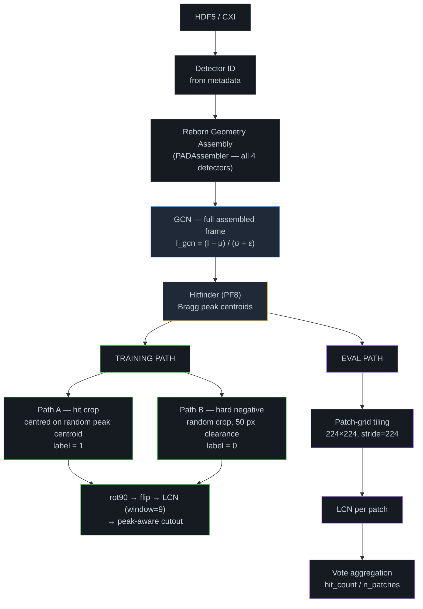

# README Full Refresh Implementation Plan

> **For agentic workers:** REQUIRED SUB-SKILL: Use superpowers:subagent-driven-development (recommended) or superpowers:executing-plans to implement this plan task-by-task. Steps use checkbox (`- [ ]`) syntax for tracking.

**Goal:** Rewrite `README.md` as a polished, accurate landing page reflecting the completed asymmetric pipeline LODO baseline, with corrected diagrams and links to `docs/` for deep detail.

**Architecture:** Single-file edit (`README.md`); no source code changes. Archive already at `docs/archive/README-2026-08-27.md`. Deep docs (`progress_notes.md`, `architecture.md`, `eval_protocol.md`, `data_spec.md`) are linked but not modified.

**Tech Stack:** Markdown, GitHub-flavoured Mermaid diagrams.

**Spec:** `docs/superpowers/specs/2026-08-27-readme-refresh-design.md`

---

### Task 1: Replace preprocessing pipeline diagram (Section 4a)

**Files:**
- Modify: `README.md` (lines 30–46 — the preprocessing flowchart block and its note)

- [ ] **Step 1: Replace the flowchart block and constraint note**

Find and replace the entire block from ` ```mermaid` (the preprocessing diagram) through the closing `> **Key constraint:**` line with:

````markdown


> **Key constraint:** GCN is always computed on the full assembled frame before cropping or tiling — never per-patch.
````

- [ ] **Step 2: Verify**

```bash
grep -n "Resize\|resize\|Key constraint" README.md
```

Expected: no matches for "Resize" or "resize"; one match for "Key constraint" containing "never per-patch".

- [ ] **Step 3: Commit**

```bash
git add README.md
git commit -m "docs(readme): replace preprocessing diagram — crop not resize, add hitfinder branching"
```

---

### Task 2: Fix two-track modeling diagram (Section 4b)

**Files:**
- Modify: `README.md` (lines 52–66 — the two-track flowchart block and its note)

- [ ] **Step 1: Update the PP node and T1 node text, and fix the constraint note**

Replace the two-track mermaid block's `PP` node text and `T1` node text:

```
# OLD PP node:
PP["Shared Preprocessing Pipeline\nHDF5/CXI → Geometry → GCN → LCN → 224×224\nidentical for both tracks"]

# NEW PP node:
PP["Shared Preprocessing Pipeline\nHDF5/CXI → Geometry → GCN → crop 224×224 → LCN\nidentical for both tracks"]

# OLD T1 node:
T1["Track 1 — Supervised Baseline\nResNet18 → ResNet50\nFine-tuned on labeled hit/non-hit frames\nPretrained weights via timm"]

# NEW T1 node:
T1["Track 1 — Supervised Baseline\nResNet18 (asymmetric pipeline)\nHitfinder-guided crop labeling\nPretrained weights via timm"]
```

Also update the note below the diagram from:

```
> **Key constraint:** Normalization (GCN → LCN) always precedes resize. Resize is for model compatibility only — not detector correction.
```

to:

```
> **Key constraint:** 224×224 is achieved via crop only — frames are never downsampled. Normalization order: GCN (full frame) → crop → LCN.
```

- [ ] **Step 2: Verify**

```bash
grep -n "Resize\|resize\|224×224" README.md
```

Expected: only occurrences of "224×224" in the updated note and diagram nodes; no occurrences of "Resize" or "resize".

- [ ] **Step 3: Commit**

```bash
git add README.md
git commit -m "docs(readme): fix two-track diagram — crop not resize, update Track 1 description"
```

---

### Task 3: Fix Target Detectors table (Section 5)

**Files:**
- Modify: `README.md` (lines 72–77 — the detectors table)

- [ ] **Step 1: Correct JUNGFRAU 4M and ePix10k raw dimensions**

Replace the table rows:

```markdown
# OLD
| `JUNGFRAU 4M` | LCLS CXI | 8 × 512 × 1024 px | 8 modules |
| `ePix10k` | LCLS | varies | multiple configurations |

# NEW
| `JUNGFRAU 4M` | LCLS CXI | 8 × 514 × 1030 px | 8 modules |
| `ePix10k` | LCLS | varies — multi-panel | multiple configurations |
```

- [ ] **Step 2: Verify**

```bash
grep -n "512 × 1024\|JUNGFRAU\|ePix10k" README.md
```

Expected: JUNGFRAU row shows `514 × 1030`; no match for `512 × 1024`.

- [ ] **Step 3: Commit**

```bash
git add README.md
git commit -m "docs(readme): fix detector raw dimensions — JUNGFRAU 4M 514×1030, ePix10k multi-panel"
```

---

### Task 4: Replace Results section (Section 7)

**Files:**
- Modify: `README.md` (lines 92–107 — the entire "Preliminary Results" section)

- [ ] **Step 1: Replace the entire results section**

Find the heading `## Preliminary Results — Phase 4 Supervised Baseline` through the closing `>` blockquote line and replace with:

```markdown
## Results — Supervised Learning Baseline (LODO, 4-fold)

Leave-one-detector-out (LODO) cross-detector generalization benchmark. Each fold holds out one detector type entirely from training and evaluates on it at test time. Metrics are computed at the frame level via patch-grid vote aggregation.

### Phase 4 Naive Baseline — frame-level labels, random crops

| Fold | Held-out | Cross AP | Cross AUC | Cross F1 |
|------|----------|----------|-----------|----------|
| 1 | AGIPD | 0.5649 | 0.5904 | 0.6661 |
| 2 | JUNGFRAU 4M | 0.8683 | 0.8156 | 0.7816 |
| 3 | ePix10k | 0.8825 | 0.8886 | 0.8092 |
| 4 | Eiger4M | 0.9310 | 0.9138 | 0.8189 |
| **Mean** | | **0.812 ± 0.167** | | |

The naive pipeline assigned frame-level hit/non-hit labels to all random 224×224 crops — including background crops from hit frames — producing ambiguous training signal. AGIPD cross AP of 0.565 reflects near-random generalization.

### Asymmetric Pipeline Baseline — hitfinder-guided crops + masked LCN

Hitfinder-guided cropping (Path A: centroid-centred, label=1 / Path B: hard-negative, label=0), variance-form masked LCN, and peak-aware cutout replace the naive strategy.

| Fold | Held-out | Cross AP | Cross AUC | Cross F1 | Δ AP |
|------|----------|----------|-----------|----------|------|
| 1 | AGIPD | 0.8074 | 0.8652 | 0.8108 | **+0.242** |
| 2 | JUNGFRAU 4M | 0.8584 | 0.9639 | 0.7570 | −0.010 |
| 3 | ePix10k | 0.8585 | 0.9106 | 0.8943 | −0.024 |
| 4 | Eiger4M | 0.8330 | 0.8596 | 0.8138 | −0.098 |
| **Mean** | | **0.839 ± 0.021** | | | **+0.027** |

- **AGIPD generalization gap largely closed:** 0.565 → 0.807 (+0.242). Hitfinder-guided crops eliminated the spurious panel-edge signal the model previously relied on.
- **Variance collapsed 8×:** ±0.167 → ±0.021 — the pipeline is now consistently effective across all four detector types.
- Full per-fold in-domain breakdown → [docs/progress_notes.md §14](docs/progress_notes.md)
```

- [ ] **Step 2: Verify section heading and key numbers**

```bash
grep -n "0.9998\|Preliminary\|0.839\|0.812\|AGIPD generalization" README.md
```

Expected: no matches for `0.9998` or `Preliminary`; matches for `0.839`, `0.812`, and `AGIPD generalization`.

- [ ] **Step 3: Commit**

```bash
git add README.md
git commit -m "docs(readme): replace synthetic results with real 4-fold LODO baseline tables"
```

---

### Task 5: Fix Setup section and add Documentation links (Sections 8 & 9)

**Files:**
- Modify: `README.md` (lines 108–136 — Setup section, and insertion point before Citation)

- [ ] **Step 1: Fix the activate command and compute note**

Find and replace in the Setup section:

```bash
# OLD compute line:
**Compute:** ASU Sol HPC — 8× NVIDIA A100 (80 GB) · SLURM scheduler

# NEW:
**Compute:** ASU Sol HPC — dedicated H100 (scg020) + A100 pool · SLURM scheduler
```

Find and replace the conda activate line:

```bash
# OLD:
conda activate sfx-hitfinder

# NEW:
source activate sfx-hitfinder
```

- [ ] **Step 2: Add Documentation section before Citation**

Insert the following block immediately before the `## Citation` heading:

```markdown
## Documentation

| Document | Contents |
|----------|----------|
| [Progress Notes](docs/progress_notes.md) | Full method notes, per-fold LODO results, pipeline decisions |
| [Architecture](docs/architecture.md) | Codebase structure and component design |
| [Evaluation Protocol](docs/eval_protocol.md) | LODO benchmark design and metrics |
| [Data Spec](docs/data_spec.md) | HDF5 key reference per detector type |

```

- [ ] **Step 3: Verify**

```bash
grep -n "conda activate\|A100 (80\|## Documentation\|## Citation" README.md
```

Expected: no match for `conda activate` or `A100 (80`; matches for `## Documentation` and `## Citation` in that order.

- [ ] **Step 4: Commit**

```bash
git add README.md
git commit -m "docs(readme): fix setup commands, add Documentation links section"
```

---

### Task 6: Tighten The Challenge prose (Section 3)

**Files:**
- Modify: `README.md` (lines 20–22 — The Challenge paragraph)

- [ ] **Step 1: Add one sentence naming the asymmetric pipeline as the solution approach**

Replace the current Challenge paragraph ending with:

```markdown
## The Challenge

Current hitfinders are calibrated per-detector. A model trained on AGIPD data at EuXFEL fails silently when deployed on JUNGFRAU data at LCLS. Every facility, every beamtime, requires manual recalibration. This project trains a single ML classifier that **generalizes across four detector types without per-detector retraining** — making hitfinding detector-agnostic. The key: a hitfinder-guided asymmetric crop strategy that assigns labels at the patch level from Bragg spot centroids, not at the frame level.
```

- [ ] **Step 2: Verify**

```bash
grep -n "asymmetric crop\|The Challenge" README.md
```

Expected: one match for "The Challenge" heading and one for "asymmetric crop" in the paragraph body.

- [ ] **Step 3: Final whole-file check**

```bash
grep -in "resize\|synthetic\|0\.9998\|conda activate\|A100 (80\|512 × 1024\|Preliminary Results" README.md
```

Expected: zero matches for all terms.

- [ ] **Step 4: Commit**

```bash
git add README.md
git commit -m "docs(readme): tighten Challenge section to name asymmetric pipeline approach"
```

---

### Task 7: Final review pass

**Files:**
- Read: `README.md`

- [ ] **Step 1: Read the full README top to bottom and check**

1. No stale numbers (`0.9998`, `A100 (80 GB)`, `512 × 1024`, `conda activate`, "Resize")
2. Both LODO tables present with correct numbers matching `checkpoints/resnet18-asymmetric-fold*/results.json`
3. Preprocessing diagram branches into TRAIN / EVAL paths
4. Two-track diagram says "crop 224×224" not "Resize"
5. Documentation section appears before Citation
6. All `docs/` links point to files that exist

- [ ] **Step 2: Verify all linked docs exist**

```bash
for f in docs/progress_notes.md docs/architecture.md docs/eval_protocol.md docs/data_spec.md; do
  ls "$f" && echo "OK: $f" || echo "MISSING: $f"
done
```

Expected: all four print `OK`.

- [ ] **Step 3: Final commit**

```bash
git add README.md
git commit -m "docs(readme): full refresh complete — real LODO results, corrected diagrams, documentation links"
```
