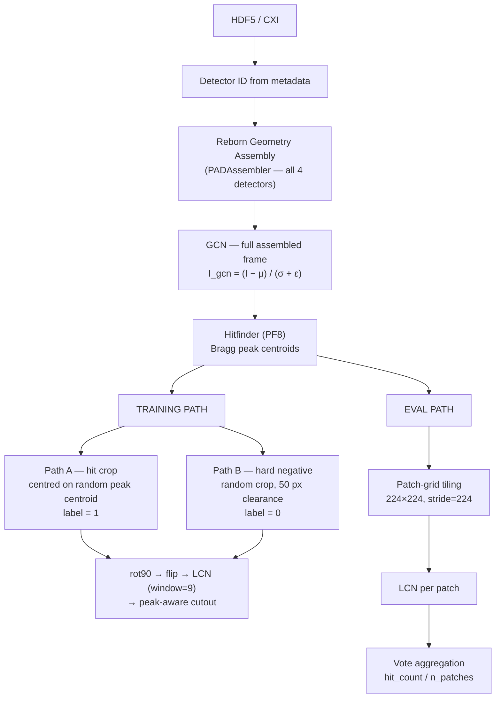

# README Full Refresh — Design Spec

**Date:** 2026-08-27
**Status:** Approved
**Scope:** Rewrite `README.md` as a polished landing page (Option B); deep detail stays in `docs/`.

---

## Goal

The current README is stale in three ways:
1. Results section shows synthetic benchmark numbers (AP=0.9998) — superseded by real 4-fold LODO results.
2. Preprocessing diagram says "Resize 224×224" — wrong (we crop, never downsample).
3. Track descriptions and key-constraint note don't reflect the asymmetric hitfinder-guided pipeline.

The refresh makes README the 2-minute read for any visitor (external researcher or lab member), with links to `docs/` for internals.

---

## Audience

Two tiers:
- **External researcher / collaborator** — explain SFX briefly, focus on what's novel (detector-agnostic, asymmetric pipeline, LODO benchmark). Gets everything they need from the README alone.
- **Lab member** — clicks through to `docs/` for pipeline spec, LODO protocol, hitfinder design, full per-fold results.

---

## Structure

```
1. Hero banner + badges
2. Elevator pitch quote (keep unchanged)
3. The Challenge (minor tightening)
4. The Approach
     4a. Preprocessing + hitfinder diagram (corrected)
     4b. Two-track modeling diagram (corrected)
5. Target Detectors table (corrected dims)
6. Project Status table (unchanged)
7. Results — two LODO tables with Δ AP column
8. Setup (minor fixes)
9. Documentation links (new section)
10. Citation + Acknowledgments (unchanged)
```

---

## Section Designs

### 4a — Preprocessing Pipeline Diagram

Replace the current linear flowchart with a branching diagram showing the shared pipeline, then training vs eval paths.



Key constraint note: *"GCN is always computed on the full assembled frame before cropping or tiling — never per-patch."*

### 4b — Two-Track Modeling Diagram

Fix `"Resize\n224 × 224"` → `"Crop 224×224\n(hitfinder-guided)"` in the Track 1 node. Update the constraint note to: *"224×224 is achieved via crop only — frames are never downsampled."*

### 5 — Target Detectors Table

Correct raw dimensions:
- JUNGFRAU 4M: `8 × 514 × 1030 px` (not `8 × 512 × 1024 px`)
- ePix10k: `varies — multi-panel` (not the wrong fixed dimensions)

### 7 — Results Section

Two tables stacked, with Δ AP column on the second to make the comparison explicit. A brief note between them explains what changed in the pipeline.

**Heading:** `## Results — Supervised Learning Baseline (LODO, 4-fold)`

**Table 1 — Phase 4 Naive Baseline** (frame-level labels, random crops):

| Fold | Held-out | Cross AP | Cross AUC | Cross F1 |
|------|----------|----------|-----------|----------|
| 1 | AGIPD | 0.5649 | 0.5904 | 0.6661 |
| 2 | JUNGFRAU 4M | 0.8683 | 0.8156 | 0.7816 |
| 3 | ePix10k | 0.8825 | 0.8886 | 0.8092 |
| 4 | Eiger4M | 0.9310 | 0.9138 | 0.8189 |
| **Mean** | | **0.812 ± 0.167** | | |

**Interstitial note:** One sentence explaining the pipeline change — hitfinder-guided crops replaced random crops, masked LCN replaced naive LCN, peak-aware cutout added.

**Table 2 — Asymmetric Pipeline Baseline** (hitfinder-guided crops + masked LCN, all PR #22 fixes):

| Fold | Held-out | Cross AP | Cross AUC | Cross F1 | Δ AP |
|------|----------|----------|-----------|----------|------|
| 1 | AGIPD | 0.8074 | 0.8652 | 0.8108 | +0.242 |
| 2 | JUNGFRAU 4M | 0.8584 | 0.9639 | 0.7570 | −0.010 |
| 3 | ePix10k | 0.8585 | 0.9106 | 0.8943 | −0.024 |
| 4 | Eiger4M | 0.8330 | 0.8596 | 0.8138 | −0.098 |
| **Mean** | | **0.839 ± 0.021** | | | **+0.027** |

**Key callouts (bullet points below table 2):**
- AGIPD generalization gap largely closed: 0.565 → 0.807 (+0.242)
- Variance collapsed 8×: ± 0.167 → ± 0.021 — pipeline now consistently effective across all four detectors
- Full per-fold in-domain breakdown → `docs/progress_notes.md §14`

### 8 — Setup

Two fixes:
- `conda activate` → `source activate sfx-hitfinder`
- Compute note: "ASU Sol HPC — dedicated H100 (scg020) + A100 pool, SLURM scheduler"

### 9 — Documentation (new section)

```markdown
## Documentation

| Document | Contents |
|----------|----------|
| [Progress Notes](docs/progress_notes.md) | Full method notes, per-fold results, pipeline decisions |
| [Architecture](docs/architecture.md) | Codebase structure and component design |
| [Evaluation Protocol](docs/eval_protocol.md) | LODO benchmark design and metrics |
| [Data Spec](docs/data_spec.md) | HDF5 key reference per detector type |
```

---

## What Does Not Change

- Hero banner and badges (phase badge wording already correct)
- The `"> Every pulse..."` elevator pitch quote
- Project Status table
- Citation and Acknowledgments

---

## Archive

Current README archived to `docs/archive/README-2026-08-27.md` before any changes.
